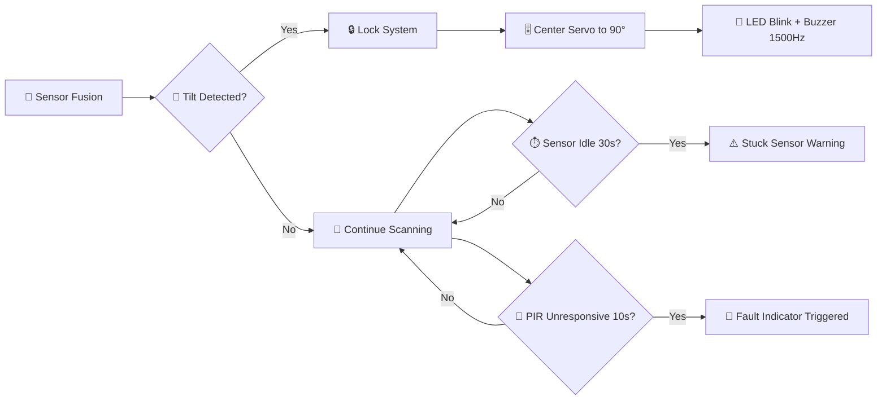

<div align="center">


<br/>


</div>

<br/>

## 🚗 RC CAR

🛡️ Implementation of Tilt Handling and Robust Fault Management for an Advanced Radar Surveillance System using ESP32, C++, and Python.

## 📡 Advanced Radar Surveillance System: Reliability and Fault Management Layer

### 🔍 Project Overview

This project features an ESP32 based autonomous radar surveillance rover designed for fixed route monitoring in environments like warehouses and restricted corridors. The system integrates multi sensor fusion (Ultrasonic, IR, LDR, and Gyroscope) to provide real time environmental mapping via a Python based dashboard.

<div align="center">

</div>

---

## 📸 Screenshots

### 🔧 Physical Rover Hardware

<div align="center">


</div>

> 🖼️ Top down view of the assembled ESP32 based rover showing the microcontroller, motor driver, ultrasonic sensors, wiring, and 4 wheel chassis.

### 📊 Radar Sensor Simulation Dashboard

<div align="center">


</div>

> 🖥️ Python based real time radar dashboard displaying live sensor simulation output from the rover's scanning mechanism.

---

## 🙋 Individual Contribution: Abdul Azeem (24I 2013)

In this collaborative project, my primary focus was on ensuring the operational reliability and environmental stability of the rover through advanced logic implementation in C++ (Arduino).

## ✨ Key Features Implemented

<details open>
<summary><b>1️⃣ 🎚️ Tilt and Uneven Surface Handling (Feature 7)</b></summary>
<br/>

- 🧭 **Instability Detection:** Developed logic using gyroscope and tilt sensors to detect directional instability or uneven terrain.
- 🔒 **System Safety Lock:** When a tilt is detected (`systemTilted`), the rover enters a "Locked" state, and the sensor scanning servo is automatically centered to 90 degrees to prevent hardware damage.
- 🚨 **Alert Feedback:** Implemented a high priority alert system where the LED blinks at 200 millisecond intervals and the buzzer emits a 1500Hz tone during instability.

</details>

<details open>
<summary><b>2️⃣ 🛠️ Robust Fault Management (Feature 8)</b></summary>
<br/>

- 📶 **Sensor Reliability Monitoring:** Created a fault detection window (10 seconds) to monitor PIR and Motion sensors. If sensors become unresponsive, the system logs a fault and triggers an indicator.
- 🐕 **Anti Stuck Logic:** Implemented a watchdog style check that monitors the tilt sensor. If the sensor remains in the same state for more than 30 seconds, a "Stuck Sensor" warning is issued via the Serial Monitor.
- 🔔 **Error Indicators:** Developed the `faultIndicator()` function to provide distinct audio visual feedback when hardware malfunctions are detected.

</details>

<div align="center">



</div>

---

## 🧪 Simulation

The hardware design and logic verification were performed on Tinkercad.

🔗 **Simulation Link:** [Circuit design Mighty Habbi Juttuli on Tinkercad](#)

<br/>

## ⚙️ Technical Stack

<div align="center">

| Component | Details | Icon |
|---|---|---|
| 🧠 **Microcontroller** | ESP32 | 📶 |
| 💻 **Firmware Language** | C++ (Arduino IDE), Python | ⌨️ |
| 🎛️ **Sensors** | MPU6050 (Gyroscope/Tilt), PIR Motion Sensors, Ultrasonic Sensors | 🔬 |
| 🦾 **Actuators** | Servo Motor (Scanning mechanism) | 🔩 |

<br/>


&nbsp;

&nbsp;


</div>

<br/>

## 📂 Repository Structure

```
RC-CAR/
├── 📘 README.md                              # Project documentation (this file)
├── 🖼️ Screenshot 2026-06-08 145451.png       # Rover hardware image
├── 🖼️ Screenshot 2026-06-08 145510.png       # Radar dashboard image
├── 📄 Simulation_0034_0080_0113_2013.pdf     # Simulation report
└── 🔧 sketch_nov23a.ino                      # Arduino firmware sketch
```

<br/>

## 🚀 How to Run

### ✅ Prerequisites

- 🔌 ESP32 board and Arduino IDE installed
- 🐍 Python 3.x for the dashboard
- 🎛️ MPU6050, PIR, and Ultrasonic sensors wired as per circuit design

### 1️⃣ Clone the repository

```bash
git clone https://github.com/AbdulAzeemHashmi/RC-CAR.git
cd RC-CAR
```

### 2️⃣ Flash the firmware

Open `sketch_nov23a.ino` in Arduino IDE, select your ESP32 board and port, then upload.

### 3️⃣ Run the dashboard

```bash
python dashboard.py
```

> ⚠️ **Note:** Ensure sensor wiring matches the Tinkercad simulation before powering on the rover.

<br/>

<div align="center">

### ⭐ If you found this project helpful, consider giving it a star

<a href="https://github.com/AbdulAzeemHashmi/RC-CAR/stargazers">

</a>

<br/><br/>

Made with 💚 by Abdul Azeem for the Advanced Radar Surveillance System project.


</div>
